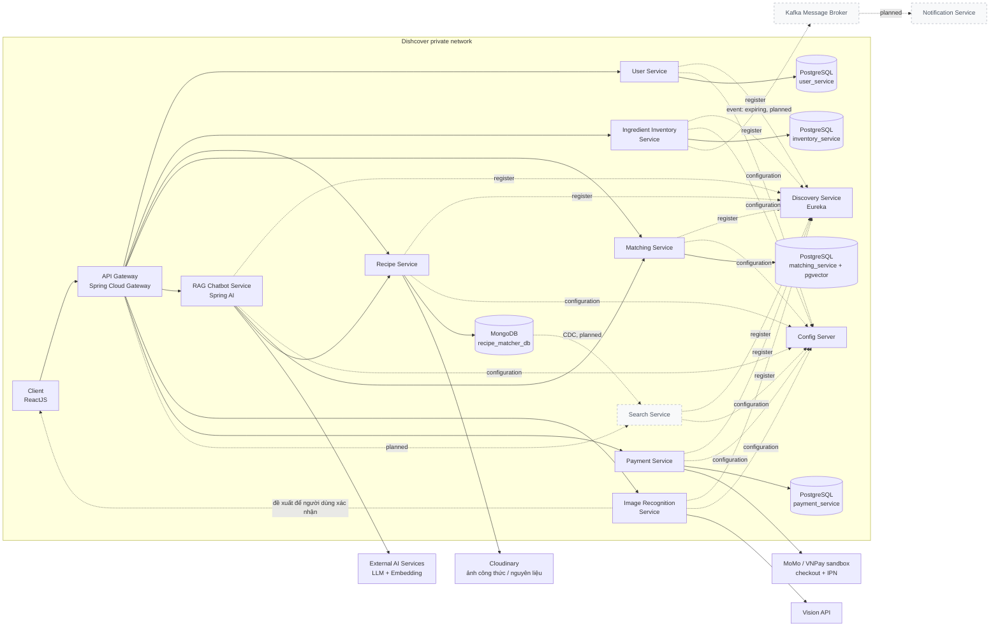

# Dishcover — Leftover Recipe Matcher

Ứng dụng gợi ý công thức nấu ăn từ nguyên liệu còn dư trong tủ lạnh, ưu tiên sử dụng nguyên liệu sắp hết hạn để giảm lãng phí thực phẩm.

> Trạng thái: đã hoàn thành nền tảng monorepo, hạ tầng dữ liệu, chuẩn hoá nguyên liệu và seed công thức. Các API nghiệp vụ (User, Inventory, Matching, RAG, Image, Payment) đang được triển khai theo thứ tự trong phần [Lộ trình](#lộ-trình-hiện-tại).

## Mục tiêu

Dishcover giải bài toán ngược với ứng dụng công thức thông thường: từ nguyên liệu người dùng đang có, tìm ra những món có thể nấu được. Ba trụ cột chính là:

- **Tủ lạnh ảo**: quản lý nguyên liệu, số lượng và hạn dùng; hỗ trợ nhập tay hoặc nhận diện từ ảnh.
- **Gợi ý công thức**: xếp hạng công thức dựa trên độ bao phủ nguyên liệu, trọng số nguyên liệu thiết yếu và mức độ sắp hết hạn.
- **Chatbot RAG**: trả lời bằng tiếng Việt, chỉ dùng công thức thực sự có trong cơ sở dữ liệu.

## Kiến trúc hệ thống

Sơ đồ dưới đây được dựng lại từ `leftover-recipe-matcher-architecture-v3.drawio`. Các thành phần nét đứt là hướng mở rộng, chưa thuộc phạm vi triển khai hiện tại.



Nguyên tắc kiến trúc không thay đổi:

- **Database-per-service ở mức logic**: mỗi service chỉ truy cập schema hoặc database của mình; trao đổi liên service đi qua REST API.
- PostgreSQL dùng chung một instance với bốn schema (`user_service`, `inventory_service`, `matching_service`, `payment_service`); Recipe Service dùng MongoDB riêng.
- Khi container hoá ứng dụng, chỉ API Gateway được expose ra ngoài. File Compose hiện chỉ dựng PostgreSQL và MongoDB phục vụ môi trường phát triển.
- Mọi lời gọi API ngoài như LLM, Vision hoặc cổng thanh toán phải có Circuit Breaker, TimeLimiter và fallback hữu ích.

## Công nghệ

| Nhóm | Công nghệ |
| --- | --- |
| Frontend | ReactJS (planned) |
| Backend | Java 21, Spring Boot 3.5.3 |
| Microservices | Spring Cloud Gateway, Eureka, Config Server |
| Dữ liệu quan hệ | PostgreSQL 16 + pgvector |
| Dữ liệu công thức | MongoDB 7 |
| AI | Spring AI; Gemini/OpenAI hoặc Ollama thay thế |
| Độ bền lời gọi ngoài | Resilience4j |
| Hình ảnh | Cloudinary |
| Thanh toán | MoMo/VNPay sandbox |

## Thành phần và cổng mặc định

| Thành phần | Cổng | Lưu trữ / trách nhiệm |
| --- | ---: | --- |
| API Gateway | 8080 | Entry point, định tuyến, JWT và kiểm tra gói FREE/PRO |
| Discovery | 8761 | Eureka service registry |
| Config Server | 8888 | Cấu hình tập trung (native backend) |
| User Service | 8081 | Người dùng, JWT, sở thích ăn uống — `user_service` |
| Inventory Service | 8082 | Tủ lạnh ảo, hạn dùng — `inventory_service` |
| Recipe Service | 8083 | CRUD công thức — MongoDB `recipe_matcher_db` |
| Matching Service | 8084 | Chấm điểm công thức, embedding — `matching_service` + pgvector |
| RAG Service | 8085 | Chatbot dựa trên công thức thật |
| Image Service | 8086 | Nhận diện nguyên liệu từ ảnh, không tự ghi dữ liệu |
| Payment Service | 8087 | Checkout, IPN, subscription — `payment_service` |

## Luồng nghiệp vụ quan trọng

### Matching công thức

Matching Service sử dụng chuỗi `ScoringRule` để dễ thêm quy tắc mà không sửa engine hiện có:

1. Jaccard làm điểm nền giữa nguyên liệu của công thức và tủ lạnh người dùng.
2. Coverage có trọng số: nguyên liệu thiết yếu `1.0`, nguyên liệu phụ `0.3`.
3. Cộng bonus cho nguyên liệu giao nhau có hạn dùng còn tối đa ba ngày.
4. Loại cứng công thức vi phạm danh sách dị ứng.
5. Sắp xếp giảm dần, trả về món phù hợp cùng nguyên liệu đã khớp và còn thiếu.

`normalized_name` là khoá so khớp thống nhất giữa Inventory, Recipe, Matching và RAG — không dùng `ingredient_id` để so khớp.

### RAG chatbot

- Giai đoạn A: trích xuất nguyên liệu từ câu hỏi, gọi Matching lấy công thức phù hợp rồi mới gọi LLM.
- Giai đoạn B: bổ sung pgvector và hybrid retrieval (hard filter qua Matching + semantic search).
- Prompt bắt buộc chỉ cho phép gợi ý món có trong Recipe DB; response trả kèm `sourceRecipeIds`.
- Nếu LLM lỗi hoặc timeout, fallback trả danh sách công thức từ retrieval, không trả màn hình lỗi trắng.

### Nhận diện ảnh

Ảnh được kiểm tra định dạng/kích thước, gửi tới Vision API, chuẩn hoá theo Ingredient Catalog rồi trả về **đề xuất**. Người dùng phải xem, sửa hoặc xác nhận kết quả trước khi client gọi Inventory Service để lưu. Image Service không gọi trực tiếp Inventory Service.

### Thanh toán và phân quyền

Gói FREE cho phép tìm kiếm/xem công thức; các tính năng có chi phí vận hành như Matching, RAG, tủ lạnh ảo và Vision dành cho PRO. Gateway chặn nhanh theo JWT claim, còn service xác thực lại gói đang còn hiệu lực. Chỉ IPN server-to-server đã kiểm tra chữ ký và amount mới được kích hoạt PRO; không tin callback hoặc redirect từ client.

## Dữ liệu dùng chung và seed

Module `common` hiện đã có:

- `VietnameseTextNormalizer`: lowercase, bỏ dấu, xử lý `đ`, loại ký tự đặc biệt và chuẩn hoá khoảng trắng.
- Ingredient Catalog tĩnh gồm 194 nguyên liệu, alias lookup và metadata category/hạn dùng/dị ứng.
- Bảng hạn dùng mặc định theo category, dùng làm fallback cho nguyên liệu ngoài catalog.

Recipe Service có profile `seed`, chỉ nạp dữ liệu nếu collection `recipes` còn rỗng:

- 10 món Việt được soạn thủ công và được kiểm tra chặt với Ingredient Catalog.
- 52 công thức từ TheMealDB, được transform bằng `scripts/fetch-themealdb.mjs` và lưu snapshot trong source.

Mọi nguyên liệu của công thức phải có `essential` và `weight` (`1.0` hoặc `0.3`) để phục vụ Matching và RAG.

## Chạy môi trường phát triển

### Yêu cầu

- JDK 21
- Docker Desktop và Docker Compose
- Node.js 18+ chỉ cần khi làm mới dữ liệu TheMealDB

### 1. Dựng database

```powershell
cd docker-setup
Copy-Item .env.example .env
# Đổi password trong .env trước khi dùng ngoài môi trường local.
docker compose up -d
docker compose ps
cd ..
```

PostgreSQL được mở ở `localhost:5432`, MongoDB ở `localhost:27017` để tiện phát triển. Đây là ngoại lệ dành cho database local; service ứng dụng sẽ chỉ giao tiếp qua private network khi được thêm vào Compose.

### 2. Đặt biến môi trường cho service

Tên database/user có giá trị mặc định cho tiện dev, nhưng **mật khẩu thì không** — thiếu biến môi trường thì service không khởi động được, thay vì âm thầm chạy bằng mật khẩu mặc định ai cũng đoán ra. Đặt 2 biến sau khớp với `docker-setup/.env` trước khi chạy service:

```powershell
$env:POSTGRES_PASSWORD = "<mật khẩu trong docker-setup/.env>"
$env:MONGO_ROOT_PASSWORD = "<mật khẩu trong docker-setup/.env>"
```

### 3. Chạy kiểm thử

```powershell
.\mvnw.cmd clean test
```

### 4. Seed công thức vào MongoDB

```powershell
.\mvnw.cmd -pl recipe spring-boot:run "-Dspring-boot.run.profiles=seed"
```

Lệnh seed idempotent: nếu collection `recipes` đã có dữ liệu thì không nạp lại. Để seed lại từ đầu, chỉ xoá volume Docker khi bạn chủ động chấp nhận mất dữ liệu local.

## Cấu trúc repository

```text
.
├── common/          # Normalizer, Ingredient Catalog, shelf-life defaults
├── discovery/       # Eureka Server
├── config/          # Spring Cloud Config Server
├── gateway/         # API Gateway
├── user/            # User/Auth service
├── inventory/       # Virtual fridge service
├── recipe/          # Recipe service, MongoDB seed data
├── matching/        # Scoring engine và pgvector store
├── rag/             # RAG chatbot
├── image/           # Vision-based recognition
├── payment/         # Payment/subscription service
├── docker-setup/    # PostgreSQL, MongoDB, schema khởi tạo
└── scripts/         # Công cụ lấy và transform dữ liệu seed
```

## Lộ trình hiện tại

- [x] Maven multi-module, Eureka, Config Server, Gateway và service skeleton.
- [x] Docker Compose cho PostgreSQL + pgvector và MongoDB; khởi tạo bốn schema PostgreSQL.
- [x] Vietnamese normalizer, Ingredient Catalog và shelf-life table, kèm unit tests.
- [x] Seed 62 công thức MongoDB, gồm món Việt và TheMealDB.
- [ ] User Service (JWT) → Inventory Service → Recipe CRUD.
- [ ] Matching theo `ScoringRule` chain.
- [ ] RAG giai đoạn A, sau đó hybrid retrieval với pgvector.
- [ ] Image Recognition, Payment/gating và bộ đánh giá AI.
- [ ] Các phần mở rộng: Kafka/Notification, Elasticsearch/Search và Cooking Mode bằng giọng nói.

## Quy ước đóng góp

- DTO không được là JPA/Mongo entity; controller xác thực input bằng `@Valid`.
- Mỗi service giữ cấu trúc `controller / service / repository / client / config / dto / exception` và có `@RestControllerAdvice` riêng.
- Secret chỉ nằm trong biến môi trường hoặc Config Server; không commit `.env`, API key, JWT secret hay connection string chứa password.
- Kiểm tra `git diff` và dấu hiệu secret trước mỗi commit; dùng Conventional Commits và không thêm `Co-Authored-By`.
