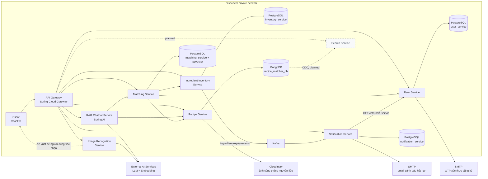

# Dishcover — Leftover Recipe Matcher

Ứng dụng gợi ý công thức nấu ăn từ nguyên liệu còn dư trong tủ lạnh, ưu tiên sử dụng nguyên liệu sắp hết hạn để giảm lãng phí thực phẩm.

> Trạng thái: 8 service backend + frontend đã hoàn thành và đang chạy thật trên AWS —
> **https://www.dishcover.online**. Việc còn lại: phân quyền Admin, Elasticsearch/Search,
> Cooking Mode giọng nói, bản mobile (xem [Lộ trình](#lộ-trình-hiện-tại)).

## Mục tiêu

Dishcover giải bài toán ngược với ứng dụng công thức thông thường: từ nguyên liệu người dùng đang có, tìm ra những món có thể nấu được. Ba trụ cột chính là:

- **Tủ lạnh ảo**: quản lý nguyên liệu, số lượng và hạn dùng; nhập tay hoặc nhận diện từ ảnh (Vision AI).
- **Gợi ý công thức**: xếp hạng công thức theo độ bao phủ nguyên liệu, trọng số nguyên liệu thiết yếu, mức độ sắp hết hạn, mục tiêu calo và sở thích ăn uống.
- **Chatbot RAG**: trả lời bằng tiếng Việt, chỉ dùng công thức thực sự có trong cơ sở dữ liệu (hybrid retrieval: lọc cứng nguyên liệu + vector search).

## Kiến trúc hệ thống


```mermaid
flowchart LR
    Client[Client\nReactJS] --> Gateway[API Gateway\nSpring Cloud Gateway]

    subgraph Platform[Dishcover private network]
        Gateway --> User[User Service]
        Gateway --> Inventory[Ingredient Inventory\nService]
        Gateway --> Recipe[Recipe Service]
        Gateway --> Matching[Matching Service]
        Gateway --> Rag[RAG Chatbot Service\nSpring AI]
        Gateway --> Image[Image Recognition\nService]
        Gateway --> Notification[Notification Service]
        Gateway -. planned .-> Search[Search Service]:::planned

        Inventory --> InventoryDb[(PostgreSQL\ninventory_service)]
        User --> UserDb[(PostgreSQL\nuser_service)]
        Matching --> MatchingDb[(PostgreSQL\nmatching_service + pgvector)]
        Notification --> NotificationDb[(PostgreSQL\nnotification_service)]
        Recipe --> Mongo[(MongoDB\nrecipe_matcher_db)]

        Rag --> Matching
        Rag --> Recipe
        Matching --> Recipe
        Matching --> Inventory
        Matching --> User
        Image -. đề xuất để người dùng xác nhận .-> Client

        Inventory -- ingredient-expiry-events --> Kafka[Kafka]
        Kafka --> Notification
        Notification -- GET /internal/users/id --> User
    end

    Rag --> AI[External AI Services\nLLM + Embedding]
    Image --> AI
    Recipe --> Cloudinary[Cloudinary\nảnh công thức / nguyên liệu]
    Notification --> SMTP[SMTP\nemail cảnh báo hết hạn]
    User --> SMTP2[SMTP\nOTP xác thực đăng ký]

    Mongo -. CDC, planned .-> Search

    classDef planned fill:#f8f9fa,stroke:#9ca3af,stroke-dasharray: 5 5,color:#4b5563;
```

Nguyên tắc kiến trúc:

- **Database-per-service ở mức logic**: mỗi service chỉ truy cập schema/database của mình; trao đổi liên service đi qua REST API (trừ Inventory → Notification qua Kafka, bất đồng bộ có chủ đích).
- PostgreSQL dùng chung một instance với bốn schema (`user_service`, `inventory_service`, `matching_service`, `notification_service`, đều dùng Flyway migration); Recipe Service dùng MongoDB riêng (`recipe_matcher_db`).
- Chỉ API Gateway expose port ra ngoài; mọi service khác chỉ giao tiếp nội bộ.
- Mọi lời gọi API ngoài (LLM, Vision) bọc Circuit Breaker + TimeLimiter (Resilience4j) và có fallback hữu ích — không bao giờ màn hình lỗi trắng.
- Nhận diện ảnh luôn có bước người dùng xác nhận trước khi ghi DB (human-in-the-loop).
- Không dùng service registry (Eureka): mỗi service chạy đúng một instance, Docker DNS (local) hoặc ECS Service Connect (AWS) đủ để phân giải địa chỉ. Gateway khai báo route tường minh, host lấy từ biến môi trường `<TÊN>_SERVICE_URL`.
- Đã gỡ Payment Service và mô hình Freemium khỏi phạm vi (2026-08-17) — mọi tính năng chỉ yêu cầu đăng nhập, không phân biệt gói.

## Công nghệ

| Nhóm | Công nghệ |
| --- | --- |
| Frontend | React + TypeScript (Vite), Tailwind CSS v4, Framer Motion, Phosphor Icons |
| Backend | Java 21, Spring Boot 3.5.3 |
| Microservices | Spring Cloud Gateway, Config Server (skeleton) |
| Dữ liệu quan hệ | PostgreSQL 16 + pgvector |
| Dữ liệu công thức | MongoDB 7 |
| AI | Spring AI — Gemini/Groq/OpenAI (LLM), OpenAI embeddings, OpenAI Vision |
| Sự kiện bất đồng bộ | Kafka (KRaft mode) — chỉ cho cảnh báo hết hạn nguyên liệu |
| Độ bền lời gọi ngoài | Resilience4j (Circuit Breaker + TimeLimiter) |
| Hình ảnh | Cloudinary |
| Hạ tầng | AWS ECS Fargate + RDS PostgreSQL + Mongo/Kafka tự host trong ECS + S3/CloudFront, quản lý bằng Terraform |

## Thành phần và cổng mặc định

| Thành phần | Cổng | Lưu trữ / trách nhiệm |
| --- | ---: | --- |
| API Gateway | 8080 | Entry point, định tuyến, xác thực JWT tập trung |
| Config Server | 8888 | Cấu hình tập trung (native backend, skeleton) |
| User Service | 8081 | Đăng ký/đăng nhập, xác thực email OTP, JWT, sở thích ăn uống — `user_service` |
| Inventory Service | 8082 | Tủ lạnh ảo, hạn dùng, quét cảnh báo hết hạn — `inventory_service` |
| Recipe Service | 8083 | CRUD công thức — MongoDB `recipe_matcher_db` |
| Matching Service | 8084 | Chấm điểm công thức (6 `ScoringRule`), embedding cho RAG — `matching_service` + pgvector |
| RAG Service | 8085 | Chatbot dựa trên công thức thật (hybrid retrieval) |
| Image Service | 8086 | Nhận diện nguyên liệu từ ảnh, không tự ghi dữ liệu |
| Notification Service | 8087 | Cảnh báo hết hạn nguyên liệu (in-app + email, qua Kafka) — `notification_service` |

## Luồng nghiệp vụ quan trọng

### Xác thực & đăng ký (OTP qua email)

Đăng ký tạo user chưa xác thực (`email_verified=false`) và gửi mã OTP 6 số qua email (mirror hành vi AWS Cognito) — **không** phát JWT ngay. Người dùng phải xác thực đúng mã (`POST /auth/verify-otp`) mới đăng nhập được. Mã lưu in-memory (TTL 10 phút, cooldown gửi lại 60s, khoá sau 5 lần sai). Gửi email lỗi sẽ báo lỗi thẳng cho client (không best-effort) vì email OTP là sản phẩm chính của luồng đăng ký, khác hẳn email cảnh báo hết hạn (best-effort, chỉ log khi lỗi).

### Matching công thức

Matching Service dùng chuỗi `ScoringRule` (Open/Closed — thêm tiêu chí mới chỉ cần thêm 1 class):

1. **Jaccard** — điểm nền giữa nguyên liệu công thức và tủ lạnh người dùng.
2. **EssentialWeight** — coverage có trọng số: nguyên liệu thiết yếu `1.0`, phụ `0.3`.
3. **ExpiryBonus** — cộng điểm nguyên liệu giao nhau có hạn dùng còn tối đa 3 ngày.
4. **CalorieProximity** — cộng điểm theo độ gần mục tiêu calo/bữa của người dùng (nếu có đặt).
5. **TagPreference** — cộng điểm theo tag ưa thích (chay/gymer/vận động viên...).
6. **AllergyFilter** — loại cứng công thức chứa nguyên liệu dị ứng (chạy cuối, có quyền phủ quyết).

`normalized_name` là khoá so khớp thống nhất giữa Inventory, Recipe, Matching và RAG — không dùng `ingredient_id`.

### RAG chatbot

Hybrid retrieval 4 kênh, ưu tiên theo thứ tự: khớp nguyên liệu (qua Matching) → khớp tên món → khớp tiêu chí danh mục → vector search ngữ nghĩa (pgvector, chỉ điền chỗ trống). Prompt bắt buộc chỉ cho phép gợi ý món có trong Recipe DB, chống prompt injection từ câu hỏi người dùng. Nếu LLM lỗi/timeout, fallback trả danh sách công thức thô từ retrieval — không bao giờ màn hình lỗi trắng.

### Nhận diện ảnh

Ảnh được kiểm tra định dạng/kích thước, gửi tới Vision API (OpenAI), chuẩn hoá theo Ingredient Catalog rồi trả về **đề xuất** kèm hạn dùng gợi ý. Người dùng phải xem, sửa hoặc xác nhận trước khi client tự gọi Inventory Service để lưu — Image Service không gọi trực tiếp Inventory Service (human-in-the-loop tuyệt đối).

### Cảnh báo hết hạn (Notification)

Inventory Service quét hàng ngày nguyên liệu sắp/đã hết hạn, publish sự kiện lên Kafka. Notification Service consume, chống trùng qua unique constraint DB (không cần bảng "đã báo" riêng), tạo thông báo in-app (poll 60s ở frontend) và cố gắng gửi email (best-effort — lỗi SMTP chỉ log, không chặn pipeline).

## Dữ liệu dùng chung và seed

Module `common` có:

- `VietnameseTextNormalizer`: lowercase, bỏ dấu, xử lý `đ`, chuẩn hoá khoảng trắng.
- Ingredient Catalog tĩnh ~200 nguyên liệu, alias lookup, metadata category/hạn dùng/dị ứng/calo trên 100g.
- Bảng hạn dùng mặc định theo category, dùng làm fallback cho nguyên liệu ngoài catalog.
- `IngredientWeights` (essential=1.0, phụ=0.3) dùng chung giữa Recipe và Matching.

Recipe Service có 153 công thức đã seed thật (10 món Việt tự soạn, 52 từ TheMealDB, 30 từ Spoonacular theo hướng ăn uống chay/gymer/vận động viên) và đã index đầy đủ embedding cho vector search. Mọi nguyên liệu của công thức phải có `essential` và `weight` để phục vụ Matching và RAG.

## Chạy môi trường phát triển

### Yêu cầu

- JDK 21, Node.js 18+
- Docker Desktop và Docker Compose

### 1. Dựng database

```powershell
cd docker-setup
Copy-Item .env.example .env
# Đổi password trong .env trước khi dùng ngoài môi trường local.
docker compose up -d
docker compose ps
cd ..
```

PostgreSQL mở ở `localhost:5432`, MongoDB ở `localhost:27017` (hoặc `27018` nếu bị trùng cổng máy khác — xem `MONGO_HOST_PORT` trong `.env`).

### 2. Đặt biến môi trường cho service

```powershell
$env:POSTGRES_PASSWORD = "<mật khẩu trong docker-setup/.env>"
$env:MONGO_ROOT_PASSWORD = "<mật khẩu trong docker-setup/.env>"
$env:JWT_SECRET = "<chuỗi ngẫu nhiên tối thiểu 32 ký tự>"
$env:INTERNAL_SERVICE_SECRET = "<chuỗi ngẫu nhiên>"
```

Các service AI (`rag`, `image`) cần thêm `GEMINI_API_KEY`/`OPENAI_API_KEY` tuỳ `LLM_PROVIDER`; xem `docs/specs/*.md` để biết chi tiết từng service.

### 3. Build + chạy kiểm thử

```powershell
.\mvnw.cmd clean install -pl common -am
.\mvnw.cmd test
```

### 4. Chạy service (mỗi service một cửa sổ terminal, không kèm `-am`)

```powershell
.\mvnw.cmd -pl user spring-boot:run
.\mvnw.cmd -pl inventory spring-boot:run
# ... tương tự cho recipe, matching, rag, image, notification, gateway
```

### 5. Chạy frontend

```powershell
cd frontend
npm install
npm run dev
```

Vite dev server proxy `/api` sang Gateway (`http://localhost:8080`) — xem `frontend/vite.config.ts`.

## Triển khai (AWS)

Bản chạy thật đang deploy trên AWS: **https://www.dishcover.online** (frontend, S3 + CloudFront) và **https://api.dishcover.online** (Gateway, ECS Fargate sau ALB). Hạ tầng quản lý bằng Terraform (`infra/aws/`), rollout qua GitHub Actions (`.github/workflows/deploy.yml`, kích hoạt thủ công — không tự deploy mỗi lần merge `master`). Chi tiết kiến trúc, chi phí ước tính và hướng dẫn từng bước: [`docs/aws-deployment-guide.md`](docs/aws-deployment-guide.md) và [`infra/aws/README.md`](infra/aws/README.md).

Hạ tầng có thể bật/tắt để tiết kiệm chi phí giữa các lần demo (`infra/aws/toggle.sh` hoặc workflow "Toggle Infra") mà không mất dữ liệu Postgres.

## Cấu trúc repository

```text
.
├── common/          # Normalizer, Ingredient Catalog, shelf-life defaults, exception/security dùng chung
├── config/          # Spring Cloud Config Server (skeleton)
├── gateway/         # API Gateway (skeleton)
├── user/            # User/Auth service — JWT, OTP email, dietary preferences
├── inventory/       # Virtual fridge service — CRUD, expiry scanner
├── recipe/          # Recipe service, MongoDB seed data
├── matching/        # Scoring engine (ScoringRule chain) và pgvector store
├── rag/             # RAG chatbot (hybrid retrieval)
├── image/           # Vision-based ingredient recognition
├── notification/    # Cảnh báo hết hạn nguyên liệu qua Kafka
├── frontend/        # React + Vite + TypeScript SPA
├── docker-setup/    # PostgreSQL, MongoDB, Kafka cho môi trường dev
├── infra/aws/       # Terraform — ECS Fargate, RDS, S3/CloudFront
├── docs/            # Specs, kiến trúc, hướng dẫn deploy
└── scripts/         # Công cụ lấy và transform dữ liệu seed
```

## Lộ trình hiện tại

- [x] Maven multi-module, Docker Compose (Postgres + pgvector, MongoDB), Vietnamese normalizer + Ingredient Catalog.
- [x] User Service — JWT, xác thực email OTP, dietary preferences, calorie goal.
- [x] Inventory Service — CRUD tủ lạnh ảo, FEFO deduction, expiry scanner.
- [x] Recipe Service — CRUD công thức, 153 công thức seed thật.
- [x] Matching Service — 6 `ScoringRule`, circuit breaker cho 3 HTTP client.
- [x] RAG chatbot — giai đoạn A (keyword+Matching) và B (vector search pgvector).
- [x] Image Recognition — OpenAI Vision, human-in-the-loop.
- [x] Notification Service — Kafka, in-app + email.
- [x] Frontend — 10 màn hình chính (đăng nhập/đăng ký/OTP, Home, tìm kiếm, tủ lạnh, gợi ý, chi tiết công thức, chatbot, tài khoản), desktop-first.
- [x] Deploy AWS thật (ECS Fargate + RDS + S3/CloudFront), CI/CD qua GitHub Actions.
- [ ] Admin — phân quyền sửa/xoá công thức (đã có spec, chưa code).
- [ ] Bản mobile, Cooking Mode bằng giọng nói, Elasticsearch/Search.

## Quy ước đóng góp

- DTO không được là JPA/Mongo entity; controller xác thực input bằng `@Valid`.
- Mỗi service giữ cấu trúc `controller / service / repository / client / config / dto / exception` và có `@RestControllerAdvice` riêng kế thừa `CommonExceptionHandler`.
- Secret chỉ nằm trong biến môi trường, Secrets Manager (AWS) hoặc Config Server; không commit `.env`, API key, JWT secret hay connection string chứa password.
- Kiểm tra `git diff` và dấu hiệu secret trước mỗi commit; dùng Conventional Commits, không thêm `Co-Authored-By`.
- Không commit/push thẳng `master` — nhánh riêng (`feat/`/`fix/`/`docs/`...) + PR, xem `CLAUDE.md` mục 13.
